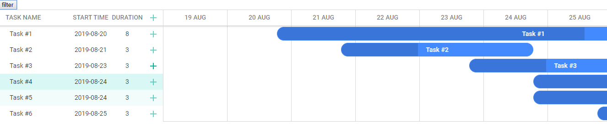
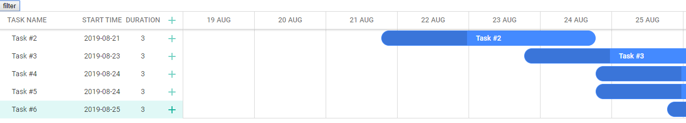
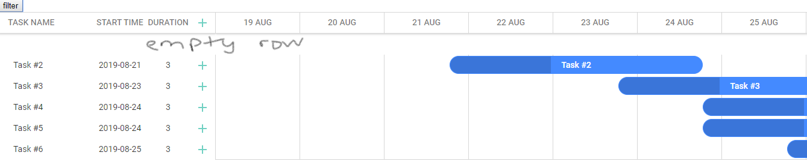

This project was bootstrapped with [Create React App](https://github.com/facebook/create-react-app).

## Problem statement

This sample project showcase a issue when using `React` with [dhtmlx-gantt](https://dhtmlx.com/docs/products/dhtmlxGantt/) library.

Terminology:

- On the left (display task name, etc) is called `Grid`
- On the right (display task bar) is called `Chart`

Background:

- This issue was not observed from `dhtmlx-gantt` < `v6.2.0` as much as I can tell.
- Using conditional to render the component also affects how the UI is being rendered - See [Sample 1]
- [dhtmlx-gantt](https://dhtmlx.com/blog/dhtmlxgantt-6-2-minor-update-boosting-gantt-chart-performance-zooming-mouse-wheel-much/) v6.2.0 onwards introduce `smart_rendering` as part of the core feature rather than as an extension
  - Somehow this affects how the render is, able to test it by turning `smart_rendering` on and off - See [Sample 2]
- Using parent and child component with `useEffect` and `useLayoutEffect` also affects the rendering - See [Sample 3]
- The discussion with `dhtmlx` team did not yield much resolution as they were not specialize in `React`

### Behavior:

Correct behavior:

On load:

On filter:

Incorrect behavior:

On load:

On filter:

### Introduction:

- Am trying to use `React` with `dhtmlx-gantt` library and then applies filter to it through `dhtmlx-gantt` API
- The sample will load 6 task on start, and filter `Task #1` away and left with 5 task after `filter` button is clicked

### Issue:

I have tested over a few variation and combination to be able to always reproduce the problem but have no idea what is exactly causing it and how to resolve it.

Sample 1:

- Using conditional loading of component will cause the UI to behave differently
- Run `npm i` and `npm start` in `state-loading` directory to see
- Try enabling and disabling the conditional login in `GanttContainer`. More information written as comments in the Class.
- Note that if using `useLayoutEffect` will work correctly

Sample 2:

- Setting `gantt.config.smart_rendering` to false will not have rendering issue but setting it to true (which is by default) will have
- Run `npm i` and `npm start` in `smart-rendering` directory to see
- Try comment / uncomment `gantt.config.smart_rendering = false;` in `GanttChart.tsx` to try it out
- Not sure what is exactly causing this, but I'll like to use the `smart_rendering` feature rather than turning it off. This is especially useful when loading huge amount of task with wide range in time period

Sample 3:

- Run `npm i` and `npm start` in `parent-child` directory to see
- The UI is not rendered (painted) correctly if using `useEffect`, changing to `useLayoutEffect` fix the issue if not using in child component
- If use `useLayoutEffect` in child component, the UI will not be rendered correctly as well

End State:

- The correct behavior should be after the filter is applied, it is always rendered and display correct no matter if it is used in parent or child component